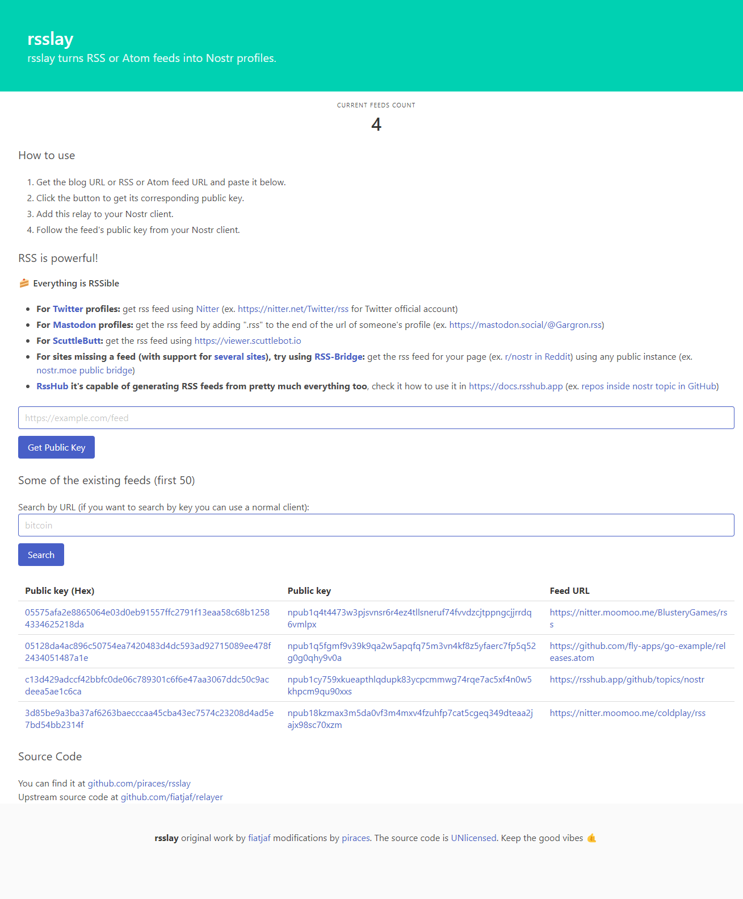

# rsslay
**Relay that creates virtual nostr profiles for each RSS feed submitted**

🚨🚨🚨 **Currently a Work-in-progress, use at your own risk!** 🚨🚨🚨


  - A Nostr relay implementation based on [relayer](https://github.com/fiatjaf/relayer/) by [fiatjaf](https://fiatjaf.com).
  - Doesn't accept any events, only emits them.
  - Does so by manually reading and parsing RSS feeds.



## Running the relay from the source

1. Clone this repository (or fork it).
2. Set the `SECRET` environment variable (a random string to be used to generate virtual private keys).
3. Set the following flags (may differ per environment):
    ```shell
    export CGO_ENABLED=1
    export GOARCH=amd64
    export GOOS=linux
    ```
4. Proceed to build the binary with the following command:
    ```shell
    go build -ldflags="-s -w -linkmode external -extldflags '-static'" -o ./rsslay
    ```

5. Run the relay!
    ```shell
    ./rsslay
    ```

_**Note:** it will create a local database file to store the currently known RSS feed URLs._

## Running the relay from the package

1. Install the package:
    ```shell
    go install github.com/piraces/rsslay
    ```
2. Set the `SECRET` environment variable (a random string to be used to generate virtual private keys).
3. Run it:
    ```shell
    rsslay
    ```
   

# License

[Unlicense](https://unlicense.org).

